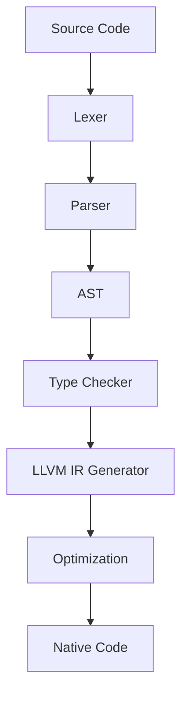

# TSPP++ Programming Language

<div align="center">


**A modern systems programming language combining TypeScript-like syntax with Go-style semantics**

[](LICENSE)
[](https://github.com/theQuarky/tspp/actions)
[](https://isocpp.org/)
[](https://llvm.org/)

</div>

## Overview

TSPP++ is an innovative programming language that brings together the familiar syntax of TypeScript with the performance and concurrency model of Go. It compiles to LLVM IR, enabling high-performance native code generation while providing advanced memory management, explicit control over memory regions, smart pointers, and zero-cost abstractions.

### Key Features

🚀 **Performance-First**: Compiles to optimized LLVM IR  
🔒 **Memory Safety**: Explicit memory region control (`#stack`, `#heap`, `#static`)  
🧠 **Smart Pointers**: Built-in support for `#shared<T>`, `#unique<T>`, `#weak<T>`  
⚡ **SIMD Operations**: Native vectorization with `#simd`  
🔧 **Zero-Cost Abstractions**: `#zerocast` for compile-time optimizations  
🛡️ **Safety Controls**: `@unsafe` annotations for explicit unsafe operations  
🎯 **TypeScript Syntax**: Familiar syntax for web developers  
🔄 **Go Semantics**: Goroutine-inspired concurrency model  

## Quick Start

### Prerequisites

- **C++ Compiler**: GCC 9+ or Clang 10+
- **CMake**: Version 3.14 or higher
- **LLVM**: Version 17 or higher
- **Boehm GC**: For garbage collection support

#### Ubuntu/Debian
```bash
sudo apt-get update
sudo apt-get install build-essential cmake llvm-17 llvm-17-dev libgc-dev
```

#### macOS
```bash
brew install cmake llvm bdw-gc
```

### Building from Source

```bash
# Clone the repository
git clone https://github.com/theQuarky/tspp.git
cd tspp

# Build the project
./build.sh

# The binary will be located at ./build/src/tspp
```

### Your First TSPP++ Program

Create a file called `hello.tspp`:

```typescript
// hello.tspp - A simple TSPP++ program
#stack string message = "Hello, TSPP++ World!";

function main(): void {
    console.log(message);
    
    // Demonstrate memory regions
    #heap int* numbers = new int[10];
    #stack int counter = 0;
    
    // SIMD operations
    #simd float[4] vector = [1.0, 2.0, 3.0, 4.0];
    
    // Smart pointer usage
    #shared<MyClass> obj = make_shared<MyClass>();
    
    // Compile-time constants
    #const int BUFFER_SIZE = 1024;
}

class MyClass {
    #private int value;
    
    constructor(val: int) {
        this.value = val;
    }
    
    #public getValue(): int {
        return this.value;
    }
}
```

Compile and run:

```bash
./build/src/tspp hello.tspp
# Output: Hello, TSPP++ World!
```

## Language Features

### Memory Management

TSPP++ provides explicit control over memory regions:

```typescript
#stack int localVar = 42;        // Stack allocation
#heap int* dynamicVar = new int(42);  // Heap allocation  
#static int globalVar = 42;      // Static/global allocation
```

### Smart Pointers

Built-in smart pointer support for safe memory management:

```typescript
#shared<Resource> resource = make_shared<Resource>();
#unique<Buffer> buffer = make_unique<Buffer>(1024);
#weak<Resource> weakRef = resource.weak_from_this();
```

### SIMD and Performance

Native SIMD support for high-performance computing:

```typescript
#simd float[4] vector1 = [1.0, 2.0, 3.0, 4.0];
#simd float[4] vector2 = [5.0, 6.0, 7.0, 8.0];
#simd float[4] result = vector1 + vector2;  // Vectorized addition
```

### Zero-Cost Abstractions

Compile-time optimizations with zero runtime overhead:

```typescript
#zerocast function<T> max(a: T, b: T): T {
    return a > b ? a : b;
}

#const int result = max(10, 20);  // Resolved at compile time
```

## Architecture

TSPP++ follows a modern compiler architecture:



### Components

- **Lexer**: Tokenizes TSPP++ source code
- **Parser**: Builds Abstract Syntax Tree (AST)
- **Type System**: Advanced type checking and inference
- **Code Generator**: LLVM IR generation
- **Runtime**: Garbage collection and memory management
- **Standard Library**: Core functionality and utilities

## Documentation

- 📖 **[Language Specification](docs/language_spec.md)** - Complete language reference
- 🔧 **[Compilation Pipeline](docs/pipeline.md)** - How TSPP++ works internally
- 📝 **[Grammar Reference](docs/grammar.md)** - EBNF grammar specification
- 🎯 **[Examples](examples/)** - Sample programs and tutorials

## Contributing

We welcome contributions! Please see our [Contributing Guide](CONTRIBUTING.md) for details.

### Quick Links

- 🐛 [Report a Bug](https://github.com/theQuarky/tspp/issues/new?template=bug_report.md)
- ✨ [Request a Feature](https://github.com/theQuarky/tspp/issues/new?template=feature_request.md)
- 💬 [Join Discussions](https://github.com/theQuarky/tspp/discussions)

## License

This project is licensed under the MIT License - see the [LICENSE](LICENSE) file for details.

## Acknowledgments

- **LLVM Project** - For the excellent compiler infrastructure
- **Boehm GC** - For garbage collection support
- **TypeScript Team** - For syntax inspiration
- **Go Team** - For semantic design inspiration

---

<div align="center">

**Made with ❤️ by the TSPP++ community**

[Website](https://tspp.dev) • [Documentation](https://docs.tspp.dev) • [Discord](https://discord.gg/tspp)

</div>
