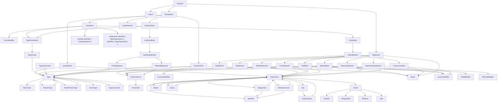

```mermaid
graph TD
  %% Top-level
  Program --> Import
  Program --> Declaration
  Program --> Statement

  %% Declarations
  Declaration --> VariableDecl
  Declaration --> FunctionDecl
  Declaration --> ClassDecl
  Declaration --> InterfaceDecl
  Declaration --> TypeAliasDecl

  %% VariableDecl and Types
  VariableDecl --> Type
  VariableDecl --> Expression
  Type --> BasicType
  Type --> PointerType
  Type --> SmartPointerType
  Type --> UnionType
  Type --> TypeConstraint
  PointerType --> Type
  SmartPointerType --> Type
  TypeConstraint --> Type

  %% Functions
  FunctionDecl --> FunctionModifier
  FunctionDecl --> ParameterList
  FunctionDecl --> Type
  FunctionDecl --> Block
  ParameterList --> Parameter

  %% Classes
  ClassDecl --> ClassModifier
  ClassDecl --> TypeParameters
  ClassDecl --> ClassBody
  ClassDecl --> Extends["extends Identifier [ TypeArguments ]"]
  ClassDecl --> Implements["implements Identifier [ TypeArguments ] { , Identifier [ TypeArguments ] }"]
  TypeParameters --> TypeParam
  TypeParam --> Type
  TypeArguments --> Type
  ClassBody --> ClassMember
  ClassMember --> FieldDecl
  ClassMember --> MethodDecl
  ClassMember --> ConstructorDecl
  ClassMember --> StaticBlock
  FieldDecl --> AccessModifier
  FieldDecl --> FieldModifier
  FieldDecl --> Type
  FieldDecl --> Expression
  MethodDecl --> AccessModifier
  MethodDecl --> MethodModifier
  MethodDecl --> ParameterList
  MethodDecl --> Type
  MethodDecl --> Block
  ConstructorDecl --> AccessModifier
  ConstructorDecl --> ParameterList
  ConstructorDecl --> Block

  %% Interfaces
  InterfaceDecl --> TypeParameters
  InterfaceDecl --> InterfaceBody
  InterfaceBody --> InterfaceMember
  InterfaceMember --> MethodSignature
  InterfaceMember --> FieldSignature
  MethodSignature --> ParameterList
  MethodSignature --> Type
  FieldSignature --> Type

  %% Statements
  Statement --> Block
  Statement --> ExpressionStatement
  Statement --> IfStatement
  Statement --> WhileStatement
  Statement --> ForStatement
  Statement --> ReturnStatement

  IfStatement --> Expression
  WhileStatement --> Expression
  ForStatement --> Expression
  ReturnStatement --> Expression
  ExpressionStatement --> Expression

  %% Expressions
  Expression --> Assignment
  Expression --> Binary
  Expression --> Unary
  Expression --> Call
  Expression --> MemberAccess
  Expression --> Literal
  Expression --> Identifier
  Assignment --> Identifier
  Assignment --> Expression
  Binary --> Expression
  Unary --> Expression
  Call --> ArgumentList
  ArgumentList --> Expression
  MemberAccess --> Expression
  MemberAccess --> Identifier
  Literal --> Number
  Literal --> StringLiteral
  Literal --> Boolean
  Literal --> Null
```