---

# TSPP++ Formal Grammar (EBNF)

(C++-like language with TypeScript syntax)

---

## 1. Program Structure

```ebnf
Program        ::= { Import | Declaration | Statement }

Import         ::= 'import' Identifier [ 'from' StringLiteral ] ';'
Declaration    ::= VariableDecl | FunctionDecl | ClassDecl | InterfaceDecl | TypeAliasDecl
Statement      ::= Block | ExpressionStatement | IfStatement | WhileStatement | ForStatement | ReturnStatement | ...
```

---

## 2. Memory and Types

```ebnf
VariableDecl   ::= [ '#' ('stack' | 'heap' | 'static') ]
									 Identifier ':' Type [ '=' Expression ] ';'

Type           ::= BasicType | PointerType | SmartPointerType | UnionType | TypeConstraint
BasicType      ::= 'int' | 'float' | 'bool' | 'string' | Identifier
PointerType    ::= [ '@' ('unsafe' | 'aligned') ] Type '*'
SmartPointerType ::= '#' ('shared' | 'unique' | 'weak') '<' Type '>'
UnionType      ::= Type '|' Type { '|' Type }
TypeConstraint ::= Type [ 'extends' Type ]
```

---

## 3. Functions

```ebnf
FunctionDecl   ::= { FunctionModifier } 'function' Identifier '(' [ ParameterList ] ')'
									 [ ':' Type ] Block

FunctionModifier ::= '#' ('const' | 'constexpr' | 'zerocast' | 'simd' | 'prefetch' | 'atomic' | 'pinned')
ParameterList  ::= Parameter { ',' Parameter }
Parameter      ::= Type Identifier
```

---

## 4. Classes and Interfaces

```ebnf
ClassDecl       ::= { ClassModifier } 'class' Identifier [ TypeParameters ]
										[ 'extends' Identifier [ TypeArguments ] ]
										[ 'implements' Identifier [ TypeArguments ]
											{ ',' Identifier [ TypeArguments ] } ]
										ClassBody

ClassModifier   ::= '#' ('abstract' | 'packed' | 'pinned' | 'final')
TypeParameters  ::= '<' TypeParam { ',' TypeParam } '>'
TypeParam       ::= Identifier [ 'extends' Type ]
TypeArguments   ::= '<' Type { ',' Type } '>'

ClassBody       ::= '{' { ClassMember } '}'
ClassMember     ::= FieldDecl | MethodDecl | ConstructorDecl | StaticBlock

FieldDecl       ::= { AccessModifier } { FieldModifier }
										Identifier ':' Type [ '=' Expression ] ';'
FieldModifier   ::= '#' ('static' | 'readonly' | 'volatile' | 'atomic'
												 | 'constexpr' | 'heap' | 'stack')
AccessModifier  ::= 'public' | 'private' | 'protected'

MethodDecl      ::= { AccessModifier } { MethodModifier }
										'function' Identifier '(' [ ParameterList ] ')'
										[ ':' Type ] Block
MethodModifier  ::= '#' ('static' | 'abstract' | 'virtual' | 'override'
												 | 'constexpr' | 'inline' | 'atomic')

ConstructorDecl ::= { AccessModifier } 'constructor' '(' [ ParameterList ] ')' Block

StaticBlock     ::= 'static' Block
```

---

## 5. Interfaces

```ebnf
InterfaceDecl  ::= 'interface' Identifier [ TypeParameters ] InterfaceBody
InterfaceBody  ::= '{' { InterfaceMember } '}'
InterfaceMember ::= MethodSignature | FieldSignature
MethodSignature ::= Identifier '(' [ ParameterList ] ')' [ ':' Type ] ';'
FieldSignature  ::= Identifier ':' Type ';'
```

---

## 6. Type Aliases

```ebnf
TypeAliasDecl  ::= 'typedef' Identifier '=' Type ';'
```

---

## 7. Statements

```ebnf
Block          ::= '{' { Statement } '}'
ExpressionStatement ::= Expression ';'

IfStatement    ::= 'if' '(' Expression ')' Statement [ 'else' Statement ]
WhileStatement ::= 'while' '(' Expression ')' Statement
ForStatement   ::= 'for' '(' [ Expression ] ';' [ Expression ] ';' [ Expression ] ')' Statement
ReturnStatement ::= 'return' [ Expression ] ';'
```

---

## 8. Expressions

```ebnf
Expression     ::= Assignment | Binary | Unary | Call | MemberAccess | Literal | Identifier | This
Assignment     ::= Identifier '=' Expression
Binary         ::= Expression Operator Expression
Unary          ::= Operator Expression
Call           ::= Expression '(' [ ArgumentList ] ')'
MemberAccess   ::= (Identifier | This) '.' Identifier
Literal        ::= Number | StringLiteral | Boolean | Null
This           ::= 'this'
ArgumentList   ::= Expression { ',' Expression }
```

---

## 9. Operators

```ebnf
Operator       ::= '+' | '-' | '*' | '/' | '%'
								 | '==' | '!=' | '<' | '>' | '<=' | '>='
								 | '&&' | '||' | '!'
								 | '&' | '|' | '^' | '<<' | '>>'
```

---

## 10. Advanced Features

```ebnf
SmartPointer   ::= '#' ('shared' | 'unique' | 'weak') '<' Type '>'
FunctionModifier ::= '#' ('const' | 'constexpr' | 'zerocast' | 'simd'
													| 'prefetch' | 'atomic' | 'pinned')
PointerType    ::= [ '@' ('unsafe' | 'aligned') ] Type '*'
TypeConstraint ::= Type [ 'extends' Type ]
UnionType      ::= Type '|' Type { '|' Type }
```

---

### Highlights of the Rewrite

✅ Class system now supports:

* Multiple modifiers (`#abstract #packed`)
* Multiple interfaces via `implements`
* Generics with constraints (`<T extends Base>`)
* Full member declarations (fields, methods, constructors, static blocks)
* C++-style access modifiers (`public`, `private`, `protected`)
* Your memory model in fields (`#heap`, `#stack`, `#static`)

✅ Syntax is consistent with TS + C++ hybrid design.
✅ Can be parsed into a rich AST with no ambiguity.

---

If you want, I can now draw a dependency diagram (SVG) showing how all grammar components link — so it’s easier to design your parser in a modular way. That would make building the interpreter/compiler much faster.

Do you want me to generate that diagram next?

---

## Grammar dependency diagram

```mermaid
graph TD
	%% Top-level
	Program --> Import
	Program --> Declaration
	Program --> Statement

	%% Declarations
	Declaration --> VariableDecl
	Declaration --> FunctionDecl
	Declaration --> ClassDecl
	Declaration --> InterfaceDecl
	Declaration --> TypeAliasDecl

	%% VariableDecl and Types
	VariableDecl --> Type
	VariableDecl --> Expression
	Type --> BasicType
	Type --> PointerType
	Type --> SmartPointerType
	Type --> UnionType
	Type --> TypeConstraint
	PointerType --> Type
	SmartPointerType --> Type
	TypeConstraint --> Type

	%% Functions
	FunctionDecl --> FunctionModifier
	FunctionDecl --> ParameterList
	FunctionDecl --> Type
	FunctionDecl --> Block
	ParameterList --> Parameter

	%% Classes
	ClassDecl --> ClassModifier
	ClassDecl --> TypeParameters
	ClassDecl --> ClassBody
	ClassDecl --> Extends["extends Identifier [ TypeArguments ]"]
	ClassDecl --> Implements["implements Identifier [ TypeArguments ] { , Identifier [ TypeArguments ] }"]
	TypeParameters --> TypeParam
	TypeParam --> Type
	TypeArguments --> Type
	ClassBody --> ClassMember
	ClassMember --> FieldDecl
	ClassMember --> MethodDecl
	ClassMember --> ConstructorDecl
	ClassMember --> StaticBlock
	FieldDecl --> AccessModifier
	FieldDecl --> FieldModifier
	FieldDecl --> Type
	FieldDecl --> Expression
	MethodDecl --> AccessModifier
	MethodDecl --> MethodModifier
	MethodDecl --> ParameterList
	MethodDecl --> Type
	MethodDecl --> Block
	ConstructorDecl --> AccessModifier
	ConstructorDecl --> ParameterList
	ConstructorDecl --> Block

	%% Interfaces
	InterfaceDecl --> TypeParameters
	InterfaceDecl --> InterfaceBody
	InterfaceBody --> InterfaceMember
	InterfaceMember --> MethodSignature
	InterfaceMember --> FieldSignature
	MethodSignature --> ParameterList
	MethodSignature --> Type
	FieldSignature --> Type

	%% Statements
	Statement --> Block
	Statement --> ExpressionStatement
	Statement --> IfStatement
	Statement --> WhileStatement
	Statement --> ForStatement
	Statement --> ReturnStatement

	IfStatement --> Expression
	WhileStatement --> Expression
	ForStatement --> Expression
	ReturnStatement --> Expression
	ExpressionStatement --> Expression

	%% Expressions
	Expression --> Assignment
	Expression --> Binary
	Expression --> Unary
	Expression --> Call
	Expression --> MemberAccess
	Expression --> Literal
	Expression --> Identifier
	Assignment --> Identifier
	Assignment --> Expression
	Binary --> Expression
	Unary --> Expression
	Call --> ArgumentList
	ArgumentList --> Expression
	MemberAccess --> Expression
	MemberAccess --> Identifier
	Literal --> Number
	Literal --> StringLiteral
	Literal --> Boolean
	Literal --> Null
```


