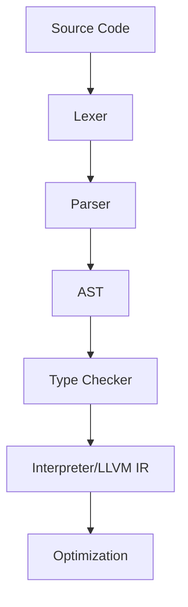

# tspp Compilation and Interpretation Pipeline

## 1. Lexical Analysis
- Tokenize source code into identifiers, keywords, symbols, literals.
- Handle custom tokens: `#stack`, `@unsafe`, smart pointers, modifiers.

## 2. Parsing (AST Construction)
- Build AST from token stream using EBNF grammar.
- Support for advanced constructs: union types, type constraints, modifiers.

## 3. Type Checking & Semantic Analysis
- Enforce type rules, constraints, and modifiers.
- Validate memory model, pointer safety, smart pointer usage.

## 4. LLVM IR or Direct Interpretation
- Optionally lower AST to LLVM IR for JIT/AOT compilation.
- Or interpret AST directly for rapid prototyping.

## 5. Optimization & Performance
- Apply zero-cost abstractions, SIMD, cache hints.
- Optimize memory access, concurrency, and type usage.

## Example Pipeline

