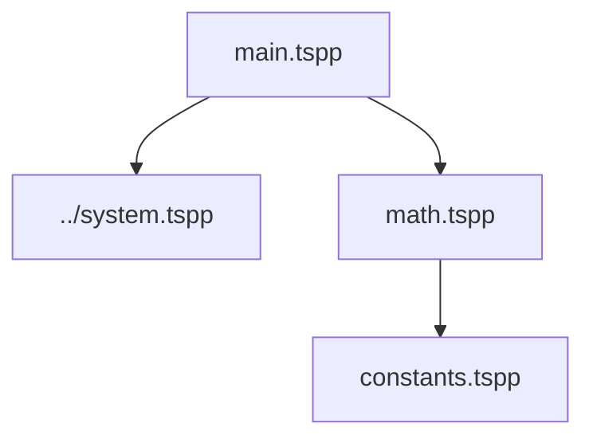

# Import Test Example

This directory contains a test case for the TSPP module import system.

## Structure

- **`main.tspp`**: The entry point. It imports:
  - `../system.tspp`: The system library (printf, write, etc.)
  - `math.tspp`: A local math module.

- **`math.tspp`**: A module that exports an `add` function. It imports:
  - `constants.tspp`: Defines constants used in math operations.

- **`constants.tspp`**: Defines `TEN` and `TWENTY`.

## Dependency Graph



## Execution Order

The compiler merges modules by prepending them. The initialization order is:
1. `system.tspp` (Global buffers, etc.)
2. `constants.tspp` (Constants)
3. `math.tspp` (Functions)
4. `main.tspp` (Entry point)

## Running

```bash
../../build/src/tspp main.tspp
```
